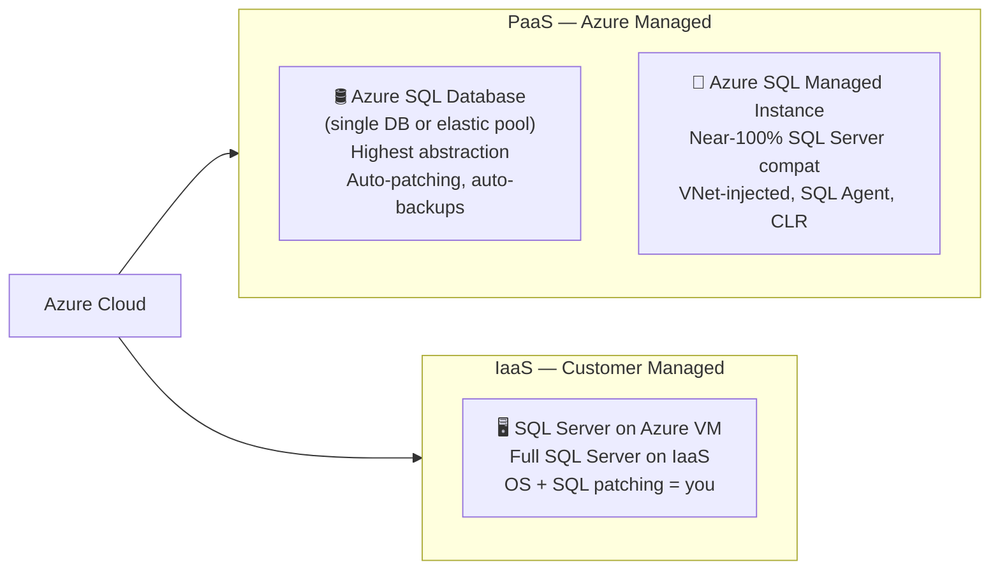

# 🛢️ Azure SQL
{: .no_toc }

**The Azure relational database family — Database, Managed Instance, and SQL on VM**
{: .fs-5 .fw-300 }

---

## Table of Contents
{: .no_toc .text-delta }

1. TOC
{:toc}

---

## Product Overview

**Azure SQL** is an umbrella term for Microsoft's family of SQL Server-compatible, cloud relational database services. The three deployment options differ in how much management responsibility you retain versus delegate to Azure:

> ⚠️ **Exam Caveat — The Core Decision:** The exam frequently asks which deployment option fits a given migration or architecture scenario. The answer almost always depends on three things: **compatibility requirements**, **network isolation needs**, and **management overhead tolerance**.

---

## Deployment Options Compared

| Feature | SQL Database | SQL Managed Instance | SQL Server on VM |
|---------|-------------|---------------------|-----------------|
| **Type** | PaaS | PaaS | IaaS |
| **SQL Server compatibility** | ~94% (some gaps) | ~99% (near-full) | 100% |
| **SQL Server Agent** | ❌ (use Elastic Jobs) | ✅ | ✅ |
| **CLR integration** | ❌ | ✅ | ✅ |
| **Linked Servers** | Limited | ✅ | ✅ |
| **Cross-database queries** | ❌ (elastic query) | ✅ | ✅ |
| **VNet injection** | ✅ (Private Endpoint) | ✅ (mandatory) | ✅ (VM in VNet) |
| **Active Directory auth** | ✅ | ✅ | ✅ |
| **OS access** | ❌ | ❌ | ✅ |
| **Patching (OS + SQL)** | Automatic | Automatic | Customer |
| **SSRS / SSAS / SSIS** | ❌ | SSRS (limited) | ✅ (full BI stack) |
| **Log shipping / mirroring** | ❌ | Limited | ✅ |
| **Auto-tuning** | ✅ | Limited | ❌ |
| **Serverless compute** | ✅ | ❌ | ❌ |
| **Hyperscale tier** | ✅ | ❌ | ❌ |
| **Min deployment time** | Seconds | **~6 hours** | Minutes |

> ⚠️ **Exam Caveat — Managed Instance Provisioning:** SQL Managed Instance takes up to **6 hours** to provision (it deploys into your VNet). If the scenario says "deploy in minutes" or "rapid provisioning", the answer is SQL Database.

---

## Azure SQL Database — Service Tiers

### DTU-based Tiers (legacy, simpler)

| Tier | Use Case | Max DB Size | Max DTUs |
|------|----------|-------------|----------|
| **Basic** | Dev/test, very low load | 2 GB | 5 |
| **Standard** | Moderate workloads | 1 TB | 3,000 |
| **Premium** | High IOPS, in-memory OLTP | 4 TB | 4,000 |

### vCore-based Tiers (recommended for production)

| Tier | Use Case | Highlights |
|------|----------|------------|
| **General Purpose** | Most workloads | Remote storage, up to 80 vCores |
| **Business Critical** | High IOPS, low latency | Local SSD, built-in read replica, In-Memory OLTP |
| **Hyperscale** | Very large DBs (up to 100 TB) | Distributed storage, rapid scale-out read replicas |
| **Serverless** | Intermittent, unpredictable load | Auto-pause/resume, billed per second of use |

> ⚠️ **Exam Caveat — Business Critical vs General Purpose vs Serverless:**
> - **Business Critical:** Includes a **free readable secondary replica** (usable for reporting) and uses local SSD storage — it is the correct tier when the scenario mentions **low latency reads** or **in-memory OLTP**.
> - **Serverless:** The Serverless compute tier can **auto-pause** after a configurable idle period. It is NOT suitable for latency-sensitive applications that cannot tolerate the **cold start delay** on first connection after pause.

---

## Elastic Pools

An **Elastic Pool** is a shared compute and storage resource that multiple SQL Databases draw from. Ideal when databases have **unpredictable, variable, or complementary usage patterns** (e.g., a SaaS application with many tenant databases).

| Property | Detail |
|----------|--------|
| Billing | Per pool (eDTUs or vCores), not per database |
| Max databases per pool | 500 (Standard) / 100 (Premium) |
| Best fit | Many DBs with bursty, variable load |
| Avoid when | All DBs peak simultaneously |

---

## High Availability
{: #high-availability }

### SQL Database HA Tiers

| Tier | HA Architecture | SLA |
|------|----------------|-----|
| **General Purpose** | Remote storage + replica (HA pair) | **99.99%** |
| **Business Critical** | 3–4 node Always On AG, local SSD | **99.99%** (+ free readable secondary) |
| **Hyperscale** | Page servers + distributed replicas | **99.99%** |
| **Serverless** | Same as General Purpose | **99.99%** |

### SQL Managed Instance HA

| Configuration | SLA |
|--------------|-----|
| Single instance (General Purpose) | **99.99%** |
| Single instance (Business Critical) | **99.99%** + readable secondary |
| Instance pool | **99.99%** |

### SQL Server on VM HA

| Pattern | SLA |
|---------|-----|
| Single VM (Premium SSD) | **99.9%** |
| Availability Set (2+ VMs) | **99.95%** |
| Availability Zones (2+ VMs) | **99.99%** |
| Always On AG across AZs | **99.99%** |

> ⚠️ **Exam Caveat — VM SLA requires multiple instances:** A single SQL Server VM only achieves **99.9%** SLA. To reach 99.99%, you need Always On AG across **Availability Zones**. The exam tests whether you know a single VM is insufficient for high availability requirements.

---

## Geo-Replication & Business Continuity

### Active Geo-Replication (SQL Database only)

Creates up to **4 readable secondary replicas** in different regions. Secondaries are readable and can be used to offload read workloads. Failover is **manual** or triggered by the application.

| Property | Detail |
|----------|--------|
| Available on | SQL Database (vCore and DTU Premium) |
| Max secondaries | 4 per primary |
| Replication | Asynchronous (RPO typically < 5 seconds) |
| Failover | Manual or app-initiated |
| Read scale-out | ✅ Secondaries are readable |

### Auto-Failover Groups

Wraps Active Geo-Replication with a **listener endpoint** (read-write and read-only) that automatically redirects connections after failover. Available for both SQL Database and SQL Managed Instance.

| Property | Detail |
|----------|--------|
| Available on | SQL Database + SQL Managed Instance |
| Listener DNS | Single endpoint survives failover |
| Failover policy | Automatic or manual |
| RPO | Typically < 5 seconds |
| RTO | Typically < 30 seconds (automatic policy) |

> ⚠️ **Exam Caveat — Auto-Failover Groups vs Active Geo-Replication:** Auto-Failover Groups provide a **single connection string** that survives regional failover — applications don't need to change endpoints. Active Geo-Replication requires the **application to detect failover and reconnect** to the secondary endpoint. If the scenario says "transparent failover" or "no application changes required", the answer is **Auto-Failover Groups**.

### Point-in-Time Restore (PITR)

All Azure SQL tiers automatically back up and retain logs to support PITR.

| Tier | Default Retention | Max Retention |
|------|------------------|---------------|
| Basic | 7 days | 7 days |
| Standard / General Purpose | 7 days | **35 days** |
| Premium / Business Critical | 7 days | **35 days** |

### Long-Term Retention (LTR)

Stores full backups in Azure Blob Storage for up to **10 years**. Configured separately from PITR.

---

## Security

| Feature | SQL Database | Managed Instance | SQL on VM |
|---------|-------------|-----------------|-----------|
| **Microsoft Entra ID auth** | ✅ | ✅ | ✅ |
| **Always Encrypted** | ✅ | ✅ | ✅ |
| **Transparent Data Encryption (TDE)** | ✅ (on by default) | ✅ (on by default) | Manual |
| **Dynamic Data Masking** | ✅ | ✅ | ❌ |
| **Row-Level Security** | ✅ | ✅ | ✅ |
| **Advanced Threat Protection** | ✅ | ✅ | ❌ (Defender) |
| **Vulnerability Assessment** | ✅ | ✅ | ❌ |
| **Private Endpoint** | ✅ | ✅ (VNet-native) | ✅ (VM in VNet) |
| **Customer-managed keys (CMK)** | ✅ | ✅ | ✅ |
| **Auditing to Log Analytics** | ✅ | ✅ | Manual |

---

## Migration Scenarios

| Source | Recommended Target | Tool |
|--------|-------------------|------|
| SQL Server on-prem, minimal changes | SQL Managed Instance | Azure Database Migration Service |
| SQL Server on-prem, full compatibility | SQL Server on VM | Azure Migrate |
| Greenfield cloud-native app | SQL Database | Azure Portal / ARM / Bicep |
| SQL Server + SSIS packages | SQL on VM or ADF (replace SSIS) | Azure Migrate + ADF |
| SQL Server + SQL Agent jobs | SQL Managed Instance | Azure DMS |

---

## Common Exam Scenarios

| Scenario | Answer |
|----------|--------|
| Migrate on-prem SQL Server with SQL Agent jobs | **SQL Managed Instance** |
| Need full OS access to the SQL Server host | **SQL Server on VM** |
| Serverless, auto-pause for dev/test | **SQL Database Serverless** |
| DB size > 4 TB in a managed service | **SQL Database Hyperscale** (up to 100 TB) |
| Readable secondary included, no extra cost | **SQL Database Business Critical** |
| Transparent failover, no app code change | **Auto-Failover Groups** |
| Backup retention > 35 days | **Long-Term Retention (LTR)** |
| Many small tenant DBs, variable load | **Elastic Pool** |
| Needs SSRS, SSAS, full BI stack | **SQL Server on VM** |
| Fastest provisioning of a managed SQL service | **SQL Database** (seconds vs MI's ~6 hours) |

---

[← Back to Home](/az-305-data-analytics/) | [02 — Azure Data Factory →](/az-305-study-notes/02-azure-data-factory/)

