# 🔀 Azure Data Factory
{: .no_toc }

**Cloud-scale data integration service — code-free and code-first ETL/ELT pipelines**
{: .fs-5 .fw-300 }

---

## Table of Contents
{: .no_toc .text-delta }

1. TOC
{:toc}

---

## Product Overview

Azure Data Factory (ADF) is a **fully managed, serverless data integration and orchestration service**. It enables you to create data-driven workflows (pipelines) that orchestrate and automate data movement and transformation across on-premises, cloud, and SaaS sources.

ADF is the **primary ETL/ELT tool** in Azure, replacing the need for on-premises SSIS packages in most cloud architectures. It also serves as the orchestration layer for Azure Synapse Analytics workloads (Synapse Pipelines is ADF embedded in a Synapse workspace).

```mermaid
flowchart LR
    subgraph Sources["Data Sources"]
        ODB["On-premises DB\n(SQL, Oracle, SAP)"]
        SaaS["SaaS Apps\n(Salesforce, ServiceNow)"]
        Cloud["Cloud Stores\n(S3, GCS, REST APIs)"]
        Azure["Azure Services\n(Blob, ADLS, SQL)"]
    end
    subgraph ADF["Azure Data Factory"]
        LS["Linked Services\n(connection definitions)"]
        DS["Datasets\n(data shape + location)"]
        PL["Pipelines\n(workflow + orchestration)"]
        ACT["Activities\n(copy, transform, control)"]
        IR["Integration Runtime\n(execution engine)"]
        TRG["Triggers\n(schedule, event, tumbling)"]
    end
    subgraph Sinks["Destinations"]
        ADLS2["ADLS Gen2 / Blob"]
        SQLDW["Azure Synapse / SQL"]
        COSMOS["Cosmos DB"]
        EH["Event Hubs"]
    end
    Sources --> LS --> DS --> PL --> ACT --> IR --> Sinks
    TRG --> PL
```

---

## Core Concepts

### Linked Services
Connection definitions that store connection strings and credentials for data sources and sinks — analogous to ODBC DSNs. A linked service points to an external store or compute resource.

### Datasets
Named references to data within a linked service — they define the **structure, location, and format** of the data (e.g., a specific Blob container folder, a SQL table, a CSV schema).

### Activities
The steps inside a pipeline. ADF has three activity categories:

| Category | Examples |
|----------|---------|
| **Data movement** | Copy Activity (the main workhorse) |
| **Data transformation** | Data Flow, Databricks Notebook, HDInsight Hive, Stored Procedure, U-SQL |
| **Control flow** | ForEach, If Condition, Until, Wait, Execute Pipeline, Set Variable, Web Activity |

### Pipelines
A logical grouping of activities that together perform a unit of work. Pipelines support branching, looping, parallelism, and error handling via control flow activities.

### Integration Runtime (IR)
The execution infrastructure for ADF activities. This is one of the **most exam-tested concepts**.

| IR Type | Location | Use Case | Available in Synapse Pipelines? |
|---------|----------|----------|---------------------------------|
| **Azure IR** | Azure (managed) | Cloud-to-cloud data movement and Data Flows; no setup required | ✅ Yes |
| **Self-hosted IR** | Customer premises or VM | Access on-premises or private-network data sources | ✅ Yes (but not shareable — see below) |
| **Azure-SSIS IR** | Azure (managed) | Lift-and-shift SSIS packages to run natively in ADF | ❌ **ADF only** |

> ⚠️ **Exam Caveat — IR Type Selection:**
> - On-premises source → **Self-hosted IR** (installed on a machine that can reach the source)
> - Cloud-to-cloud → **Azure IR**
> - Migrating SSIS packages without rewriting → **Azure-SSIS IR** (**ADF only**)
> - Self-hosted IR can be **shared across multiple ADF instances** — this sharing capability is **ADF only and does not apply to Synapse Pipelines**

> ⚠️ **Exam Caveat — ADF-Only IR Features:** Two IR capabilities are exclusive to ADF and unavailable in Synapse Pipelines:
> - **Shared self-hosted IR:** ADF allows one self-hosted IR to be shared (linked) across multiple data factories. Synapse Pipelines does not support this — each workspace must deploy its own self-hosted IR independently.
> - **Azure-SSIS IR:** Only ADF can host an Azure-SSIS IR for running SSIS packages natively. If the scenario involves lifting SSIS packages to the cloud, the answer is **ADF**, not Synapse Pipelines.

### Triggers
Define when a pipeline runs:

| Trigger Type | Description |
|-------------|-------------|
| **Schedule** | Cron-based schedule (e.g., every day at 02:00 UTC) |
| **Tumbling Window** | Fixed, non-overlapping time slices; supports dependency chaining |
| **Storage Event** | Fires when a blob is created or deleted in Azure Blob/ADLS |
| **Custom Event** | Fires when a custom event arrives via Azure Event Grid |

> ⚠️ **Exam Caveat — Tumbling Window vs Schedule:** Tumbling Window triggers have **retry and dependency** features — they guarantee that each window is processed exactly once and in order. Schedule triggers do not have this guarantee. Use Tumbling Window for time-partitioned pipelines where **backfill and ordering** matter.

---

## Mapping Data Flows

**Mapping Data Flows** are visually designed, code-free transformations that run on **Azure Databricks Spark clusters** under the hood (fully managed by ADF, no cluster management needed). They support:

- Joins, aggregations, pivots, lookups, conditional splits
- Schema drift handling (dynamic schema evolution)
- Data quality and cleansing rules
- Debug mode for interactive testing

> ⚠️ **Exam Caveat:** Mapping Data Flows use **Spark as the execution engine** — they are not suitable for small datasets or latency-sensitive scenarios. They are designed for **batch transformations on large datasets**. For low-latency transformations, use a Stored Procedure activity or an Azure Function activity.

---

## Monitoring & Management

| Feature | Detail |
|---------|--------|
| **Monitor tab** | Visual pipeline run history, activity status, duration, errors |
| **Azure Monitor integration** | Pipeline metrics → Log Analytics, alerts on failure |
| **Diagnostic logs** | Activity runs, trigger runs, pipeline runs to Log Analytics |
| **Email alerts** | Configured via Azure Monitor action groups |
| **Git integration** | ADF supports GitHub or Azure DevOps Git for CI/CD of pipeline definitions |

---

## Security

| Feature | Detail |
|---------|--------|
| **Managed Identity** | Preferred for authenticating to Azure services without storing credentials |
| **Key Vault integration** | Linked service credentials stored in Key Vault; ADF fetches at runtime |
| **Managed VNet** | ADF managed virtual network for private connectivity to data sources |
| **Private Endpoints** | Managed private endpoints from ADF managed VNet to sources/sinks |
| **RBAC roles** | `Data Factory Contributor`, `Data Factory Operator` |
| **Encryption at rest** | AES-256; CMK supported via Key Vault |

---

## ADF vs Synapse Pipelines

| Aspect | Azure Data Factory | Synapse Pipelines |
|--------|-------------------|-------------------|
| **Location** | Standalone service | Embedded in Synapse workspace |
| **Feature parity** | Full feature set | Near-identical (shared codebase) |
| **Best for** | Standalone ETL, cross-workspace orchestration | ETL within a Synapse analytics project |
| **Licensing** | Separate resource | Included with Synapse workspace |
| **Integration** | Via linked services to Synapse | Native — pipelines can trigger Spark/SQL pool jobs directly |
| **Data sharing across instances** | ✅ Share data across data factories | ❌ Not supported |
| **Cross-region data flows** | ✅ Supported | ❌ Not supported |
| **Azure-SSIS IR** | ✅ Full support | ❌ Not supported |
| **Shared self-hosted IR** | ✅ One IR can be linked across multiple factories | ❌ Not supported — each workspace needs its own |

> ⚠️ **Exam Caveat — When ADF Is Required Over Synapse Pipelines:** Despite sharing the same underlying engine, there are four scenarios where the answer must be **ADF** rather than Synapse Pipelines:
> - **SSIS packages:** Azure-SSIS IR only exists in ADF. If the scenario mentions lifting SSIS packages to Azure, Synapse Pipelines cannot do it.
> - **Shared IR across workloads:** If multiple teams or factories need to share one self-hosted IR node, ADF supports linked/shared self-hosted IRs; Synapse does not.
> - **Cross-region data flows:** ADF supports running Data Flows in a different Azure region from the source data; Synapse Pipelines does not.
> - **Multi-workspace data sharing:** ADF pipelines can share datasets and linked services across factories; Synapse workspaces are isolated in this regard.

---

## Pricing Model

| Component | Billing |
|-----------|---------|
| **Orchestration** | Per pipeline activity run (DIU-hours for Copy, vCore-hours for Data Flow) |
| **Copy Activity** | Per Data Integration Unit (DIU) hour |
| **Data Flow** | Per vCore-hour (cluster startup + execution time) |
| **Azure IR** | Per DIU-hour |
| **Self-hosted IR** | No ADF charge (customer pays for the VM) |
| **Azure-SSIS IR** | Per vCore-hour while running |

> ⚠️ **Exam Caveat:** Azure-SSIS IR is **billed per hour while running**, even if no packages execute. It should be **started just before SSIS package execution and stopped immediately after** to control costs.

---

## Common Exam Scenarios

| Scenario | Answer |
|----------|--------|
| Move data from on-premises Oracle to ADLS Gen2 | ADF pipeline with **Self-hosted IR** |
| Lift-and-shift existing SSIS packages to cloud | **ADF** with **Azure-SSIS IR** (Synapse cannot do this) |
| Share one self-hosted IR node across multiple pipelines in different factories | **ADF** shared self-hosted IR (not available in Synapse Pipelines) |
| Schedule-based batch ETL, cloud sources only | ADF pipeline with **Azure IR** + Schedule trigger |
| Trigger pipeline when a file lands in Blob storage | ADF **Storage Event trigger** |
| Code-free large-scale data transformation | ADF **Mapping Data Flow** |
| Store connection string securely in ADF | **Key Vault-backed Linked Service** |
| ETL within a Synapse Analytics workspace | **Synapse Pipelines** (same as ADF, when no ADF-only features needed) |
| Incremental data load with time-window ordering | ADF **Tumbling Window trigger** |
| ADF pipeline credentials using managed identity | **Managed Identity** on ADF linked service |

---

[← 01 — Azure SQL](/az-305-data-analytics/01-azure-sql/) | [03 — Azure Stream Analytics →](/az-305-data-analytics/03-azure-stream-analytics/)