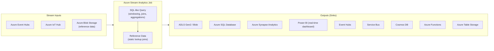

# 🔊 Azure Stream Analytics
{: .no_toc }

**Serverless real-time stream processing with familiar SQL syntax**
{: .fs-5 .fw-300 }

---

## Table of Contents
{: .no_toc .text-delta }

1. TOC
{:toc}

---

## Product Overview

Azure Stream Analytics (ASA) is a **fully managed, serverless real-time analytics service** for processing high-velocity streaming data using a SQL-like query language. It is designed to continuously query, filter, aggregate, and route streaming data from sources like IoT devices, application logs, and event streams — with **sub-second to second-level latency**.

ASA sits at the intersection of ingestion (Event Hubs, IoT Hub) and storage/action (SQL, Power BI, Blob, Functions), making it the standard real-time processing layer in Azure IoT and analytics reference architectures.



---

## Core Concepts

### Streaming Units (SUs)
The unit of compute for an ASA job. Each SU provides approximately **1 MB/s** of input throughput for simple queries.

| SUs | Approx Input Throughput |
|-----|------------------------|
| 1 SU | ~1 MB/s |
| 6 SU | ~6 MB/s |
| 192 SU | ~192 MB/s (max default) |

> ⚠️ **Exam Caveat:** SU allocation can be changed **while the job is running** (scale up/down without stopping). However, the job must be **stopped to change the number of partitions** in the input source.

### Inputs

| Input Type | Source | Purpose |
|------------|--------|---------|
| **Stream input** | Event Hubs, IoT Hub | Real-time event stream |
| **Reference input** | Blob Storage | Static lookup data joined to the stream |

> ⚠️ **Exam Caveat:** Reference data from Blob is loaded at **job start** and refreshed on a configurable schedule. It is NOT live-updated — it is for relatively static lookup tables (e.g., device metadata, product catalogue).

### Outputs
ASA supports a rich set of output adapters. Key exam outputs:

| Output | Notes |
|--------|-------|
| **Power BI** | Real-time push dataset for live dashboards (no intermediate storage) |
| **Azure SQL Database** | Standard relational sink for processed results |
| **Azure Synapse Analytics** | Direct write to dedicated SQL pool |
| **Cosmos DB** | Low-latency document store output |
| **Azure Functions** | Trigger custom serverless logic per event |
| **Event Hubs** | Chain to another stream processor |

---

## Windowing Functions

Windowing is the most exam-tested concept in Stream Analytics. Windows define how to group time-based streaming data for aggregation.

### Tumbling Window
Fixed-size, **non-overlapping**, contiguous time segments. Every event belongs to exactly one window.

```sql
SELECT DeviceId, AVG(Temperature) AS AvgTemp
FROM IoTInput TIMESTAMP BY EventTime
GROUP BY DeviceId, TumblingWindow(minute, 5)
```

> Use for: regular aggregations with no overlap — e.g., average temperature every 5 minutes.

### Hopping Window
Fixed-size windows that **advance by a hop interval** smaller than the window size — windows **overlap**.

```sql
GROUP BY DeviceId, HoppingWindow(minute, 10, 5)
-- 10-minute windows, advancing every 5 minutes
```

> Use for: rolling averages — e.g., 10-minute average recalculated every 5 minutes.

### Sliding Window
Windows triggered by **events**, containing all events within the specified duration before the triggering event. Only outputs when the content changes.

```sql
GROUP BY DeviceId, SlidingWindow(minute, 5)
```

> Use for: detecting conditions within a duration relative to each event — e.g., alert if > 3 errors in any 5-minute period.

### Session Window
Groups events separated by **gaps in activity**. The window grows as long as events keep arriving within the gap timeout.

```sql
GROUP BY DeviceId, SessionWindow(minute, 2, 30)
-- min gap 2 min, max window 30 min
```

> Use for: user session analysis, IoT device active periods.

### Summary Table

| Window | Overlap | Event-driven | Use Case |
|--------|---------|-------------|----------|
| **Tumbling** | ❌ | ❌ | Regular periodic aggregation |
| **Hopping** | ✅ | ❌ | Rolling averages |
| **Sliding** | ✅ | ✅ | Event-proximity conditions |
| **Session** | ❌ | ✅ | Activity-gap grouping |

> ⚠️ **Exam Caveat — Windowing Selection:** This is a high-frequency exam topic. The key differentiator: **Tumbling = no overlap, fixed**. **Hopping = overlap, fixed hop**. **Sliding = overlap, event-triggered**. **Session = variable size, gap-based**.

---

## Temporal Joins

ASA supports joining a stream to reference data or another stream within a time window:

```sql
SELECT S.DeviceId, R.Location
FROM Stream S
JOIN ReferenceBlob R ON S.DeviceId = R.DeviceId
```

For stream-to-stream joins, a **DATEDIFF** constraint is required to bound the join window (ASA cannot hold unbounded state):

```sql
SELECT A.SessionId, B.Action
FROM StreamA A
JOIN StreamB B ON A.SessionId = B.SessionId
AND DATEDIFF(minute, A, B) BETWEEN 0 AND 5
```

---

## Compatibility Levels

| Level | Notes |
|-------|-------|
| **1.0** | Original; legacy behaviour |
| **1.1** | Improved array handling, datetime |
| **1.2** | Current default; geo-spatial functions, improved timestamp |

> ⚠️ **Exam Caveat:** Set compatibility level to **1.2** for new jobs. The exam may reference behaviour differences between levels — 1.2 is always the preferred answer for new workloads.

---

## Geo-Spatial Functions

ASA natively supports **geo-spatial queries** on streaming data (compatibility level 1.2+):

- `ST_DISTANCE` — distance between two points
- `ST_WITHIN` — test if a point is inside a polygon (geofencing)
- `ST_INTERSECTS` — polygon intersection

> Use case: IoT geofencing alerts — e.g., alert when a vehicle leaves a defined zone.

---

## Scaling & Partitioning

ASA scales by partitioning both the input and the query:

| Concept | Detail |
|---------|--------|
| **Partition key** | Must align between input (Event Hub partition key) and ASA `PARTITION BY` clause |
| **Embarrassingly parallel** | Query is fully parallelised when partition key aligns end-to-end input→query→output |
| **Max SUs** | 192 SUs (default); higher via support request |
| **Edge jobs** | ASA can run on **Azure IoT Edge** devices for local processing before cloud ingestion |

---

## Security & Networking

| Feature | Detail |
|---------|--------|
| **Managed Identity** | Authenticate to Event Hubs, IoT Hub, Storage, SQL without storing keys |
| **Private Endpoints** | ASA can connect to inputs/outputs via managed private endpoints |
| **Encryption at rest** | AES-256 for job definitions and state |
| **CMK** | Customer-managed key support for job state encryption |

---

## Common Exam Scenarios

| Scenario | Answer |
|----------|--------|
| Average sensor reading every 5 minutes, no overlap | **Tumbling Window** |
| 10-minute rolling average recalculated every 1 minute | **Hopping Window** |
| Alert if 3 errors occur in any 5-minute span | **Sliding Window** |
| Group IoT events by device active session | **Session Window** |
| Real-time Power BI dashboard from IoT telemetry | ASA → **Power BI output** |
| Join streaming device data with static device metadata | ASA **Reference Data input** (Blob) |
| Process events at the IoT edge before sending to cloud | **ASA on IoT Edge** |
| Geofencing alert when vehicle leaves a zone | ASA **ST_WITHIN** geo-spatial function |
| Scale ASA job without stopping it | Adjust **Streaming Units** (live scaling) |
| Stream telemetry to both SQL and Power BI simultaneously | ASA supports **multiple outputs** per job |

---

[← 02 — Azure Data Factory](/az-305-data-analytics/02-azure-data-factory/) | [04 — Azure Synapse Analytics →](/az-305-data-analytics/04-azure-synapse-analytics/)