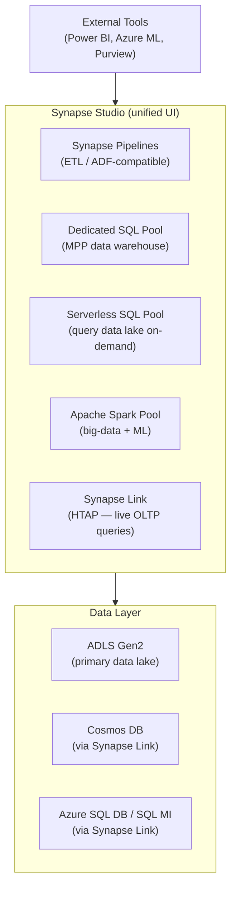

# 🏭 Azure Synapse Analytics
{: .no_toc }

**Unified analytics platform combining data warehousing, big-data, and data integration**
{: .fs-5 .fw-300 }

---

## Table of Contents
{: .no_toc .text-delta }

1. TOC
{:toc}

---

## Product Overview

Azure Synapse Analytics is a **unified analytics platform** that brings together enterprise data warehousing, big-data processing, data integration (pipelines), and exploratory analytics into a single workspace — Synapse Studio.

It is Azure's **evolution of Azure SQL Data Warehouse (SQL DW)**, significantly extended with Apache Spark, serverless query, integrated pipelines, and direct links to operational databases.

---

## SQL Pools
{: #sql-pools }

### Dedicated SQL Pool (formerly SQL DW)

A **massively parallel processing (MPP) relational data warehouse** built for large-scale analytical queries over structured data.

| Property | Detail |
|----------|--------|
| Architecture | MPP — 1 control node + N compute nodes |
| Scale unit | **Data Warehouse Units (DWUs)** — DW100c to DW30000c |
| Storage | Columnar, compressed; separate from compute |
| Pause/resume | ✅ Compute can be paused (you pay for storage only) |
| Best for | Scheduled analytics, large structured datasets, complex SQL queries |
| Distribution | Hash, round-robin, or replicated per table |
| Max table size | Unlimited (ADLS Gen2-backed) |

> ⚠️ **Exam Caveat — Pause to Save Cost:** Dedicated SQL Pool compute can be **paused when not in use** — you continue paying only for storage. This is a key cost optimisation the exam tests. However, pausing means a **warm-up delay** when resuming — unsuitable for always-on BI tools.

> ⚠️ **Exam Caveat — Distribution Strategy:**
> - **Hash distribution** on a column: best for large fact tables — reduces data movement during joins
> - **Round-robin**: uniform distribution, best for staging tables
> - **Replicated**: small dimension tables copied to every compute node — eliminates shuffle for joins

### Serverless SQL Pool

An **on-demand query engine** that lets you query files in ADLS Gen2 (Parquet, CSV, JSON, Delta Lake, ORC) using standard T-SQL — with **no infrastructure to provision**.

| Property | Detail |
|----------|--------|
| Architecture | Pay-per-query (billed per TB of data processed) |
| No provisioning | ✅ Always on, no scale unit to configure |
| Best for | Ad-hoc exploration, data lake queries, building views over files |
| Supported formats | Parquet, CSV, JSON, Delta Lake, ORC |
| External tables | Can create external tables over ADLS files for BI tool connectivity |
| Max query duration | 24 hours |

> ⚠️ **Exam Caveat — Dedicated vs Serverless SQL Pool:**
> - **Dedicated** = provisioned, billed by DWU-hour, best for **regular scheduled workloads with predictable query patterns**
> - **Serverless** = on-demand, billed per TB scanned, best for **ad-hoc, infrequent, or exploratory queries on the data lake**
> - Serverless cannot ingest or write data — it is **read-only** (queries external data)

---

## Apache Spark Pool

A **fully managed Spark cluster** within Synapse for big-data processing, data engineering, machine learning, and streaming.

| Property | Detail |
|----------|--------|
| Cluster management | ✅ Fully managed; auto-start and auto-stop |
| Languages | PySpark, Scala, .NET Spark, SparkR, SQL |
| Auto-scale | ✅ Scales nodes up/down based on workload |
| Auto-pause | ✅ Cluster pauses after configurable idle period |
| Delta Lake | ✅ Native support |
| Integration | Can write results to Dedicated SQL Pool via `spark.write.synapsesql()` |
| Node sizes | Small → XX-Large (memory-optimised options available) |

> ⚠️ **Exam Caveat — Spark Pool vs Dedicated SQL Pool:** Spark is better for **schema-on-read, unstructured/semi-structured data, ML, and complex transformations**. Dedicated SQL Pool is better for **structured, high-concurrency BI queries with strict SLAs**. Both can coexist in the same Synapse workspace.

---

## Synapse Pipelines

Functionally identical to **Azure Data Factory** (shared codebase). Synapse Pipelines are the native integration layer for orchestrating data movement and transformation within a Synapse workspace.

| Activity | Notes |
|----------|-------|
| Copy Activity | Moves data between sources and sinks |
| Data Flow | Visual Spark-based transformations (same as ADF Mapping Data Flows) |
| Notebook Activity | Triggers a Spark notebook |
| SQL Pool Activity | Runs a stored procedure or SQL script on Dedicated SQL Pool |

### Integration Runtime in Synapse Pipelines

Synapse Pipelines support the same **Azure IR** and **Self-hosted IR** types as ADF, but with two important restrictions that are frequently tested:

| IR Type | Supported in Synapse Pipelines? | Notes |
|---------|--------------------------------|-------|
| **Azure IR** | ✅ Yes | Cloud-to-cloud movement and Data Flows; default IR |
| **Self-hosted IR** | ✅ Yes (limited) | On-premises / private network access; **cannot be shared** |
| **Azure-SSIS IR** | ❌ No | ADF only — for running SSIS packages natively |

**Synapse Pipelines IR limitations vs ADF:**

| Capability | Azure Data Factory | Synapse Pipelines |
|------------|-------------------|-------------------|
| Shared self-hosted IR (linked across workspaces) | ✅ Supported | ❌ Not supported |
| Azure-SSIS IR (SSIS package execution) | ✅ Supported | ❌ Not supported |
| Cross-region data flows | ✅ Supported | ❌ Not supported |
| Data sharing across factory / workspace instances | ✅ Supported | ❌ Not supported |

> ⚠️ **Exam Caveat — Synapse Pipelines IR Limitations:** Although Synapse Pipelines and ADF share the same engine, Synapse Pipelines has four IR-related gaps the exam exploits:
> - **No Azure-SSIS IR:** If the scenario involves running or migrating SSIS packages, **ADF is the only valid answer** — Synapse Pipelines cannot host an Azure-SSIS IR.
> - **No shared self-hosted IR:** In ADF, a single self-hosted IR node can be shared (linked) across multiple data factories, reducing infrastructure costs. Synapse workspaces cannot share a self-hosted IR — each workspace must install and manage its own.
> - **No cross-region data flows:** ADF can execute Mapping Data Flows in a region different from the data source. Synapse Pipelines cannot, which matters for data residency and latency scenarios.
> - **No cross-workspace data sharing:** ADF supports sharing datasets and linked services across factories. Synapse workspaces are isolated — data sharing must be handled via ADLS Gen2 or Synapse Link instead.

---

## Synapse Link

Synapse Link creates a **near-real-time analytical replica** of operational databases in Synapse — enabling HTAP (Hybrid Transactional/Analytical Processing) without impacting the source database's performance.

| Source | Notes |
|--------|-------|
| **Azure Cosmos DB** | GA; analytical store mirrors Cosmos DB data automatically |
| **Azure SQL Database** | GA; change feed replicated to Synapse |
| **SQL Server 2022** | GA; on-premises SQL Server link to Synapse |

> ⚠️ **Exam Caveat:** Synapse Link for Cosmos DB uses a **separate analytical store** that is columnar and does NOT consume Cosmos DB RUs for analytical queries. This is the correct answer when the scenario says "run analytics on Cosmos DB data without affecting OLTP performance".

---

## Security

| Feature | Detail |
|---------|--------|
| **Workspace Managed Identity** | Used by Synapse to access ADLS Gen2 and other services |
| **Synapse RBAC** | Workspace-level roles: Synapse Administrator, SQL Administrator, Apache Spark Administrator, Synapse Contributor |
| **Column-level security** | Available on Dedicated SQL Pool |
| **Row-level security** | Available on Dedicated SQL Pool |
| **Dynamic Data Masking** | Available on Dedicated SQL Pool |
| **Private Endpoints** | Managed VNet + managed private endpoints for network isolation |
| **Entra ID auth** | ✅ For both Dedicated and Serverless SQL Pool |
| **CMK encryption** | ✅ Workspace encryption with customer-managed key |
| **Purview integration** | Data lineage and cataloguing via Microsoft Purview |

---

## Monitoring

| Tool | Purpose |
|------|---------|
| **Synapse Studio Monitor hub** | Pipeline runs, Spark job history, SQL requests, trigger runs |
| **Azure Monitor** | Metrics, diagnostic logs, alerts for Synapse workspace |
| **Log Analytics** | Query Synapse diagnostic logs for deep troubleshooting |
| **Dynamic Management Views (DMVs)** | T-SQL-based query monitoring for Dedicated SQL Pool |

---

## SLA

| Component | SLA |
|-----------|-----|
| Dedicated SQL Pool | **99.9%** |
| Serverless SQL Pool | **99.9%** |
| Apache Spark Pool | **99.9%** |
| Synapse Pipelines | **99.9%** |

---

## Common Exam Scenarios

| Scenario | Answer |
|----------|--------|
| Scheduled nightly ETL + data warehouse for BI | **Dedicated SQL Pool** + Synapse Pipelines |
| Ad-hoc queries on Parquet files in a data lake | **Serverless SQL Pool** (pay-per-TB) |
| Machine learning feature engineering on raw data | **Apache Spark Pool** |
| Reduce cost — warehouse only used 8h/day | **Pause Dedicated SQL Pool** outside business hours |
| Analytics on Cosmos DB without using RUs | **Synapse Link for Cosmos DB** (analytical store) |
| Query data lake with Power BI, no provisioning | **Serverless SQL Pool** + external tables |
| Complex ETL with Spark transformations in Synapse | **Synapse Pipelines + Notebook Activity** |
| Row-level security on warehouse data | **Dedicated SQL Pool** row-level security |
| Unified platform for DW + Spark + pipelines | **Azure Synapse Analytics workspace** |
| Hash vs round-robin distribution on fact table | **Hash distribution** on the join key |
| Migrate on-premises SSIS packages — use Synapse or ADF? | **ADF** — Azure-SSIS IR is not available in Synapse Pipelines |
| Ingest data from on-premises SQL Server into Synapse, IR shared across teams | **ADF** with shared self-hosted IR — Synapse Pipelines cannot share a self-hosted IR |

---

[← 03 — Azure Stream Analytics](/az-305-data-analytics/03-azure-stream-analytics/) | [04 — Azure Databricks →](/az-305-data-analytics/05-azure-databricks/)