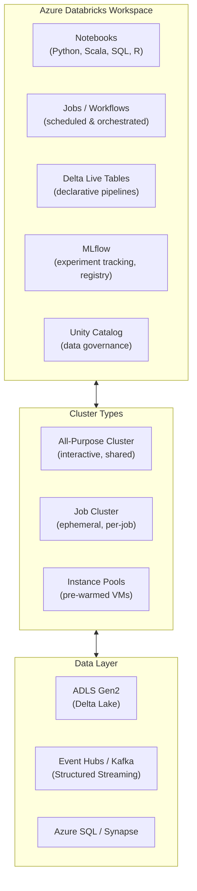

# 🔥 Azure Databricks
{: .no_toc }

**Apache Spark-based unified analytics platform — data engineering, ML, and streaming**
{: .fs-5 .fw-300 }

---

## Table of Contents
{: .no_toc .text-delta }

1. TOC
{:toc}

---

## Product Overview

Azure Databricks (ADB) is a **first-party Azure analytics platform** built on Apache Spark, jointly developed by Microsoft and Databricks. It provides a collaborative workspace for data engineers, data scientists, and ML engineers to write notebooks, build pipelines, train models, and run streaming jobs — all on managed Spark clusters.

Databricks differs from Synapse Spark pools in that it offers a **richer developer experience**, **Unity Catalog** for fine-grained data governance, **MLflow integration** for experiment tracking, and **Delta Live Tables** for declarative pipeline management.



---

## Core Concepts

### Workspace
The top-level resource. Contains notebooks, clusters, jobs, MLflow experiments, Delta Live Tables, and the Unity Catalog metastore. Deployed into an Azure resource group and integrated with a **managed VNet or customer VNet**.

### Clusters

| Cluster Type | Purpose | Billing |
|-------------|---------|---------|
| **All-Purpose** | Interactive development and shared exploratory work | Billed per DBU while running |
| **Job Cluster** | Ephemeral cluster created for a specific job run, terminated on completion | Billed per DBU, lower DBU rate than all-purpose |
| **Instance Pools** | Pre-warmed VM pool to reduce cluster start time | Billed for idle VMs in pool |

> ⚠️ **Exam Caveat — Job vs All-Purpose Cluster Cost:** Job clusters are **cheaper per DBU** than all-purpose clusters and should be preferred for **production scheduled workloads**. All-purpose clusters are kept running between sessions and incur idle costs — they are suitable only for interactive development.

### Databricks Units (DBUs)
The billing unit for Databricks. DBU consumption depends on cluster size, VM type, and tier (Standard vs Premium). Billed per DBU-hour.

---

## Delta Lake

Delta Lake is an **open-source storage layer** that brings ACID transactions, schema enforcement, and time travel to data lakes (typically ADLS Gen2 with Parquet files).

| Feature | Detail |
|---------|--------|
| **ACID transactions** | Full atomicity, consistency, isolation, durability on data lake files |
| **Schema enforcement** | Rejects writes that do not match the table schema |
| **Schema evolution** | Controlled schema changes without breaking readers |
| **Time travel** | Query previous versions of a table: `SELECT * FROM table VERSION AS OF 5` |
| **Upserts (MERGE)** | Efficient CDC and SCD operations via `MERGE INTO` |
| **Z-ordering** | Co-locate related data in files for faster predicate filtering |
| **Compaction (OPTIMIZE)** | Merges small files into larger files to improve read performance |
| **Vacuum** | Removes old file versions beyond the retention threshold |

> ⚠️ **Exam Caveat — Delta Lake for CDC/SCD:** Delta Lake's `MERGE INTO` is the standard pattern for **slowly changing dimensions (SCD Type 1/2)** and **change data capture (CDC)** in a lakehouse architecture. If the scenario mentions SCD or CDC with Databricks, the answer involves Delta Lake MERGE.

---

## Delta Live Tables (DLT)

A **declarative framework** for building reliable, maintainable, and testable data pipelines on Delta Lake. DLT manages:

- Pipeline DAG execution and retries
- Data quality constraints (expectations)
- Incremental vs full refresh modes
- Automatic schema management

```python
@dlt.table
@dlt.expect_or_drop("valid_temperature", "temperature BETWEEN -50 AND 150")
def clean_sensor_data():
    return dlt.read_stream("raw_sensors").filter("sensor_type = 'temperature'")
```

| Pipeline Mode | Detail |
|--------------|--------|
| **Triggered** | Runs once on-demand or on a schedule |
| **Continuous** | Runs continuously for near-real-time streaming |

---

## MLflow

MLflow is **natively integrated** into Databricks for the full ML lifecycle:

| Component | Purpose |
|-----------|---------|
| **Tracking** | Log parameters, metrics, artifacts per experiment run |
| **Projects** | Package ML code for reproducibility |
| **Models** | Register, version, and stage models (Staging → Production) |
| **Model Serving** | REST endpoint for real-time model inference |

---

## Unity Catalog

**Unity Catalog** is the centralised data governance layer for Databricks, providing fine-grained access control across workspaces and cloud accounts.

| Feature | Detail |
|---------|--------|
| **Three-level namespace** | `catalog.schema.table` — supports multiple catalogs |
| **Fine-grained permissions** | Column-level, row-level, table-level, schema-level |
| **Data lineage** | Automatic end-to-end lineage tracking |
| **Audit logs** | All data access events logged |
| **External locations** | Managed access to ADLS Gen2, S3, GCS paths |
| **Delta Sharing** | Secure, open-protocol data sharing across organisations |

> ⚠️ **Exam Caveat — Unity Catalog vs Workspace-level security:** Unity Catalog provides **cross-workspace governance** — permissions set in Unity Catalog apply across all workspaces in an account. Workspace-level security is isolated per workspace. If the scenario mentions centralised governance across multiple Databricks workspaces, the answer is **Unity Catalog**.

---

## SKU Tiers

| Tier | Features |
|------|---------|
| **Standard** | Notebooks, clusters, jobs, Delta Lake, basic RBAC |
| **Premium** | + Unity Catalog, passthrough auth, audit logs, Delta Live Tables, token management, private link |

> ⚠️ **Exam Caveat:** Unity Catalog, Delta Live Tables, and fine-grained access control require **Premium tier**. If the scenario mentions column-level security or cross-workspace governance, Premium is required.

---

## Networking & Security

| Feature | Detail |
|---------|--------|
| **Managed VNet (default)** | Databricks manages the VNet; simpler setup |
| **VNet Injection (customer VNet)** | Deploy Databricks data plane into your own VNet for network isolation |
| **Private Link** | Secure access to Databricks control plane and workspace over private endpoints |
| **Managed Identity** | Databricks clusters access ADLS Gen2 and other services via managed identity |
| **SCIM provisioning** | Sync users and groups from Entra ID to Databricks automatically |
| **Token management** | Personal access tokens for API auth; Premium tier adds token lifetime controls |
| **Encryption at rest** | AES-256; CMK supported via Key Vault |
| **Encryption in transit** | TLS 1.2+ for all cluster communications |

> ⚠️ **Exam Caveat — VNet Injection:** VNet Injection is required when Databricks clusters need to access resources in a **private VNet** (e.g., SQL Managed Instance, on-premises via ExpressRoute). The managed VNet cannot access private resources outside the Databricks-managed network.

---

## Structured Streaming

Databricks natively supports **Apache Spark Structured Streaming** for continuous, micro-batch stream processing:

| Feature | Detail |
|---------|--------|
| **Sources** | Kafka, Event Hubs (Kafka protocol), Delta Lake (change data feed), Auto Loader |
| **Sinks** | Delta Lake, Kafka, ADLS Gen2, Synapse, Cosmos DB |
| **Auto Loader** | Incremental file ingestion from ADLS Gen2 — scalable, no manual partition management |
| **Checkpointing** | Fault-tolerant exactly-once processing via checkpoint location |

---

## Common Exam Scenarios

| Scenario | Answer |
|----------|--------|
| Data scientists need interactive Spark notebooks | **All-Purpose cluster** in Databricks |
| Nightly batch ETL at lowest cost | **Job cluster** (ephemeral, cheaper DBU) |
| Reduce cluster start-up time for critical jobs | **Instance Pools** |
| ACID transactions on data lake files | **Delta Lake** |
| Slowly changing dimension Type 2 in lakehouse | **Delta Lake MERGE INTO** |
| Query a previous version of a Delta table | **Delta Lake Time Travel** |
| Unified data governance across multiple workspaces | **Unity Catalog** (Premium) |
| Column-level security on Delta tables | **Unity Catalog** (Premium) |
| Databricks access to SQL Managed Instance in private VNet | **VNet Injection** |
| Real-time streaming with exactly-once semantics | **Structured Streaming + Delta Lake checkpointing** |
| Manage ML experiments and model versions | **MLflow** integrated in Databricks |
| Declarative pipeline with data quality expectations | **Delta Live Tables** |

---

[← 04 — Azure Synapse Analytics](/az-305-data-analytics/04-azure-synapse-analytics/) | [06 — Azure IoT Hub →](/az-305-study-notes/06-azure-iot-hub/)