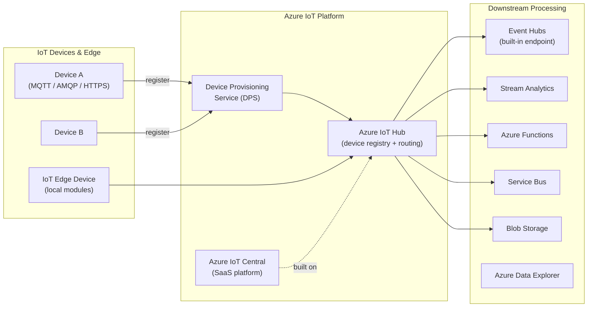

# 📡 Azure IoT
{: .no_toc }

**Device connectivity, management, and telemetry ingestion at scale**
{: .fs-5 .fw-300 }

---

## Table of Contents
{: .no_toc .text-delta }

1. TOC
{:toc}

---

## Product Overview

Azure IoT is a suite of services for connecting, monitoring, and managing IoT devices at scale, then routing device telemetry into analytics and action pipelines. The two main IoT platform services are:

- **Azure IoT Hub** — PaaS service for bidirectional device communication, routing, and management. Full developer control.
- **Azure IoT Central** — SaaS fully managed IoT application platform. Code-free device management and dashboards.

Additional supporting services include **Device Provisioning Service (DPS)**, **Azure Digital Twins**, **Azure Sphere** (OS-level device security), and **Azure IoT Edge** (local compute on devices).



---

## Azure IoT Hub

IoT Hub is a **fully managed PaaS service** that acts as a central message hub for bidirectional communication between an IoT application and its devices at scale.

### Core Capabilities

| Capability | Detail |
|------------|--------|
| **Device-to-Cloud (D2C)** | Devices send telemetry, file uploads, and reported property updates |
| **Cloud-to-Device (C2D)** | Back-end sends commands, desired property updates, direct methods |
| **Device Twin** | JSON document storing device metadata (reported + desired properties + tags) |
| **Direct Methods** | Synchronous RPC-style invocation of device-side functions |
| **File Upload** | Devices upload large files to Azure Blob Storage via IoT Hub-issued SAS tokens |
| **Device Registry** | Stores device identity and credentials for up to millions of devices |
| **Message Routing** | Route messages to different endpoints based on message body or properties |

### Protocols Supported

| Protocol | Notes |
|----------|-------|
| **MQTT** | Default IoT protocol; port 8883 (TLS) |
| **MQTT over WebSockets** | Port 443 |
| **AMQP** | Port 5671 |
| **AMQP over WebSockets** | Port 443 |
| **HTTPS** | Request-response only; no server-push |

> ⚠️ **Exam Caveat:** Devices behind firewalls that only allow outbound **port 443** should use **MQTT over WebSockets** or **AMQP over WebSockets** — not bare MQTT (port 8883).

### Device Twin

A JSON document in the cloud that represents the **desired state** (set by the back-end) and **reported state** (sent by the device), plus read-only **tags** (set by the back-end, invisible to the device).

```json
{
  "deviceId": "sensor-001",
  "tags": { "location": "Building-A", "floor": 3 },
  "properties": {
    "desired": { "telemetryInterval": 30 },
    "reported": { "telemetryInterval": 30, "firmware": "2.1.0" }
  }
}
```

> ⚠️ **Exam Caveat — Twin vs Direct Method vs C2D:**
> - **Device Twin desired properties** → persistent configuration changes (device picks up when it reconnects)
> - **Direct Methods** → immediate synchronous command (device must be online)
> - **Cloud-to-Device messages** → one-way commands with at-least-once delivery, no response

---

## IoT Hub Tiers

| Tier | Max Messages/Day | Max Devices | Features |
|------|-----------------|-------------|---------|
| **Free** | 8,000 | 500 | Dev/test only |
| **Basic (B1–B3)** | 400K – 300M | Unlimited | D2C only, no C2D, no Device Twin queries |
| **Standard (S1–S3)** | 400K – 300M | Unlimited | Full features: C2D, Device Twin, Direct Methods, File Upload |

> ⚠️ **Exam Caveat — Basic vs Standard Tier:**
> - **Basic tier**: Device-to-Cloud messages **only**. No Cloud-to-Device commands, no Device Twin queries, no Direct Methods.
> - **Standard tier**: Full bidirectional capabilities.
> - If the scenario requires **sending commands to devices** or **querying device state**, the answer is **Standard tier**.

### Units Scaling

Each tier supports multiple units (e.g., S1 × 10 = 4 million messages/day). Units scale linearly — you cannot mix tiers after creation.

> ⚠️ **Exam Caveat — Tier Upgrade:** You can upgrade from Basic to Standard, or scale up units, **without recreating** the IoT Hub. You **cannot downgrade** from Standard to Basic.

---

## Message Routing

IoT Hub **Message Routing** sends incoming device messages to different endpoints based on filter conditions:

| Endpoint Type | Notes |
|--------------|-------|
| **Built-in (Event Hubs-compatible endpoint)** | Default; all messages go here if no routing rules match |
| **Azure Event Hubs** | Custom Event Hub namespace |
| **Azure Service Bus Queue/Topic** | For command-and-control patterns |
| **Azure Blob Storage** | Archive telemetry directly |
| **Azure Cosmos DB** | Direct device-to-Cosmos write |

Routing rules use a SQL-like condition on message properties or body:

```sql
temperatureAlert = true AND deviceType = 'sensor'
```

> ⚠️ **Exam Caveat — Routing vs Event Grid:** IoT Hub message routing is **pull-based** (endpoint polls) and routes to a fixed set of endpoint types. For dynamic event-driven reactions (e.g., trigger a function when a device connects/disconnects), use **IoT Hub + Azure Event Grid** (IoT Hub publishes lifecycle events to Event Grid).

---

## Device Provisioning Service (DPS)

DPS enables **zero-touch, just-in-time provisioning** of devices to the right IoT Hub without manual registration, supporting factory-floor device enrollment at scale.

| Feature | Detail |
|---------|--------|
| **Attestation mechanisms** | X.509 certificates, TPM, Symmetric key |
| **Enrollment types** | Individual enrollment (one device) or Enrollment Group (many devices with shared certificate) |
| **Load balancing** | Can distribute devices across multiple IoT Hubs by weight or location |
| **Linked IoT Hubs** | One DPS can provision to multiple IoT Hubs |

> ⚠️ **Exam Caveat:** DPS is the answer for **large-scale device deployment** where devices must self-register at boot without pre-configuration. If the scenario mentions "zero-touch provisioning" or "factory enrollment", DPS is the right service.

---

## Azure IoT Central

IoT Central is a **fully managed, SaaS IoT application platform** that reduces the time to build, manage, and connect IoT solutions — without requiring IoT expertise.

| Aspect | IoT Hub | IoT Central |
|--------|---------|-------------|
| **Type** | PaaS — developer-controlled | SaaS — managed application |
| **Device templates** | Manual SDK integration | ✅ Visual device templates |
| **Dashboards** | Build with external tools | ✅ Built-in dashboards |
| **Rules & actions** | Build with Stream Analytics / Functions | ✅ Built-in no-code rules |
| **Extensibility** | Full | Via data export + webhooks |
| **Customisation** | Full | Limited |
| **Best for** | Custom enterprise IoT solutions | Rapid deployment, non-dev teams |

> ⚠️ **Exam Caveat — IoT Central vs IoT Hub:** If the scenario says "fastest time to production", "no custom code", or "operations team manages devices", the answer is **IoT Central**. If the scenario requires custom processing, full protocol control, or deep integration, the answer is **IoT Hub**.

---

## Azure IoT Edge

IoT Edge runs Azure services and custom logic **directly on IoT devices** as containerised modules, enabling local processing before sending data to the cloud.

| Feature | Detail |
|---------|--------|
| **Runtime** | Containerised modules (Docker-compatible) on the device |
| **Supported modules** | Stream Analytics, Functions, custom containers, AI models |
| **Connectivity** | Edge device appears as a single device to IoT Hub; leaf devices connect through it |
| **Offline capability** | ✅ Local processing continues if cloud connectivity is lost |
| **Use cases** | Local ML inference, data filtering before cloud ingestion, latency-sensitive control |

---

## Security

| Feature | Detail |
|---------|--------|
| **Per-device credentials** | SAS tokens or X.509 certificates per device |
| **Shared Access Policies** | Namespace-level SAS policies (e.g., `iothubowner`, `service`, `device`) |
| **Private Endpoints** | ✅ IoT Hub supports private endpoints for VNet isolation |
| **IP filtering** | Restrict inbound connections to specific IP ranges |
| **Defender for IoT** | Agentless and agent-based threat detection for OT/IoT devices |
| **TLS enforcement** | TLS 1.2 minimum |

---

## Common Exam Scenarios

| Scenario | Answer |
|----------|--------|
| Devices send telemetry only, no C2D needed, lowest cost | **IoT Hub Basic** tier |
| Send commands to devices, query device state | **IoT Hub Standard** tier |
| Device behind firewall — only port 443 allowed | **MQTT over WebSockets** |
| Set persistent configuration on a device | **Device Twin desired properties** |
| Immediate synchronous command to an online device | **Direct Method** |
| Zero-touch factory provisioning across multiple IoT Hubs | **Device Provisioning Service (DPS)** |
| No-code IoT solution, business user manages devices | **Azure IoT Central** |
| Local ML inference on device, offline resilience | **Azure IoT Edge** |
| Route temperature alerts to Service Bus, archive all to Blob | **IoT Hub Message Routing** (multiple endpoints) |
| React to device connect/disconnect events | **IoT Hub + Event Grid** (lifecycle events) |
| OT/industrial network device security monitoring | **Microsoft Defender for IoT** |

---

[← 05 — Azure Databricks](/az-305-data-analytics/05-azure-databricks/) | [07 — Feature Comparison →](/az-305-study-notes/07-feature-comparison/)