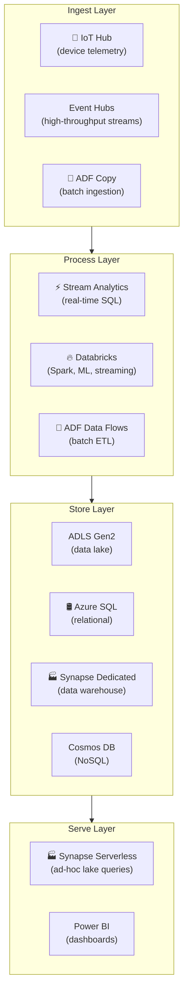

# 📊 Feature Comparison — All Six Services
{: .no_toc }

**The definitive side-by-side reference for AZ-305 data & analytics scenario questions**
{: .fs-5 .fw-300 }

---

## Table of Contents
{: .no_toc .text-delta }

1. TOC
{:toc}

---

## The Big Picture — Architecture Layers

---

## SQL Deployment Options
{: #sql-deployment-options }

Use this table when a scenario involves a **relational database** requirement:

| Decision Factor | SQL Database | SQL Managed Instance | SQL Server on VM |
|----------------|-------------|---------------------|-----------------|
| Minimal management overhead | ✅ Best | ✅ Good | ❌ (you manage OS) |
| Near-100% SQL Server compatibility | ❌ (~94%) | ✅ | ✅ (100%) |
| SQL Server Agent required | ❌ | ✅ | ✅ |
| Cross-database queries (multi-DB) | ❌ | ✅ | ✅ |
| Full BI stack (SSRS, SSAS, SSIS) | ❌ | Partial | ✅ |
| VNet-isolated by default | ❌ (opt-in) | ✅ (mandatory) | ✅ |
| Serverless / auto-pause | ✅ | ❌ | ❌ |
| DB size > 4 TB (managed) | ✅ (Hyperscale, up to 100 TB) | ❌ (max ~8 TB) | ✅ |
| Auto-tuning / auto-indexing | ✅ | Limited | ❌ |
| Provisioning speed | **Seconds** | **~6 hours** | Minutes |
| Transparent failover (auto-failover groups) | ✅ | ✅ | Manual (Always On AG) |
| Backup retention > 35 days | ✅ (LTR, up to 10 yr) | ✅ (LTR) | Manual |

---

## ETL & Data Integration
{: #etl--data-integration }

| Decision Factor | Azure Data Factory | Synapse Pipelines | Databricks |
|----------------|-------------------|-------------------|-----------|
| Best for | Enterprise-wide ETL, multi-platform | ETL within Synapse workspace | Complex transformations, ML, streaming ETL |
| Code-free option | ✅ (Mapping Data Flows) | ✅ (same) | ❌ (notebook-based) |
| SSIS lift-and-shift | ✅ (Azure-SSIS IR) | ❌ | ❌ |
| On-premises source | ✅ (Self-hosted IR) | ✅ (Self-hosted IR) | ✅ (VNet Injection) |
| Spark transformations | ✅ (via Databricks linked service or Data Flows) | ✅ (Notebook Activity) | ✅ Native |
| ML model training | ❌ | ❌ | ✅ (MLflow) |
| Delta Lake native | ❌ (can read/write) | ✅ (Spark pool) | ✅ Native |
| Streaming ETL | ❌ (batch) | ❌ (batch) | ✅ (Structured Streaming) |
| Data governance | Limited | Microsoft Purview | Unity Catalog |
| Serverless billing | ✅ (per activity run) | ✅ | ❌ (cluster always running) |

---

## Real-Time Streaming
{: #real-time-streaming }

| Decision Factor | Stream Analytics | Databricks Streaming | Event Hubs (raw) |
|----------------|-----------------|---------------------|------------------|
| Query language | **SQL-like** (familiar) | PySpark / Scala | None (just ingestion) |
| Setup complexity | Low | Medium–High | Very low |
| Windowing support | ✅ (Tumbling, Hopping, Sliding, Session) | ✅ (Spark window functions) | ❌ |
| ML model scoring | Limited | ✅ (native MLflow models) | ❌ |
| Output to Power BI real-time | ✅ Direct output | ❌ | ❌ |
| Exactly-once processing | ✅ | ✅ (with checkpoints) | ❌ (at-least-once) |
| Geo-spatial queries | ✅ Native | ✅ (libraries) | ❌ |
| Scale unit | Streaming Units (SUs) | Cluster nodes | Throughput Units |
| Best for | SQL-savvy teams, IoT telemetry aggregation | ML-infused streaming, complex transformations | Pure ingestion buffer |

---

## Analytics Platform Selection

| Decision Factor | Synapse Dedicated SQL | Synapse Serverless SQL | Databricks |
|----------------|----------------------|----------------------|-----------|
| **Primary use** | BI/reporting on structured DW | Ad-hoc lake exploration | Data engineering, ML, streaming |
| **Billing** | Per DWU-hour (even when idle unless paused) | Per TB scanned | Per DBU-hour |
| **Best cost profile** | Regular, predictable query loads | Infrequent or exploratory queries | Batch jobs (job clusters) |
| **Pause/resume** | ✅ | N/A (always on, no infra) | Auto-terminate clusters |
| **Concurrent queries** | High (MPP architecture) | Moderate | High (Spark parallelism) |
| **Unstructured / semi-structured data** | ❌ | ✅ (Parquet, JSON, CSV) | ✅ Native |
| **ML / AI workloads** | ❌ | ❌ | ✅ |
| **Delta Lake ACID** | Limited | ✅ (read Delta) | ✅ Native (read + write) |
| **Write to Dedicated SQL Pool** | N/A (is the pool) | ❌ (read-only) | ✅ (`synapsesql` connector) |

---

## IoT Ingestion
{: #iot-ingestion }

| Decision Factor | IoT Hub (Standard) | IoT Hub (Basic) | IoT Central | Event Hubs |
|----------------|-------------------|----------------|-------------|------------|
| Device-to-Cloud messages | ✅ | ✅ | ✅ | ✅ (generic) |
| Cloud-to-Device commands | ✅ | ❌ | ✅ | ❌ |
| Device Twin / state | ✅ | ❌ | ✅ | ❌ |
| Direct Methods | ✅ | ❌ | ✅ | ❌ |
| Device management UI | ❌ (build it) | ❌ | ✅ Built-in | ❌ |
| Zero-touch provisioning (DPS) | ✅ | ✅ | ✅ | ❌ |
| Custom routing rules | ✅ | ✅ | Limited | ❌ |
| Best for | Custom enterprise IoT | Telemetry-only, lowest cost | Rapid SaaS IoT | Non-IoT event streams |
| MQTT protocol | ✅ | ✅ | ✅ | ❌ (AMQP/Kafka) |

---

## SLA Summary

| Service / Tier | SLA |
|---------------|-----|
| SQL Database (all vCore tiers) | **99.99%** |
| SQL Managed Instance | **99.99%** |
| SQL Server on VM (single) | **99.9%** |
| SQL Server on VM (AZ, Always On AG) | **99.99%** |
| Azure Data Factory | **99.99%** |
| Azure Stream Analytics | **99.9%** |
| Synapse Analytics (all pools) | **99.9%** |
| Azure Databricks | **99.95%** |
| Azure IoT Hub (Standard + Basic) | **99.9%** |
| Azure IoT Central | **99.9%** |

> ⚠️ **Exam Caveat:** Azure SQL Database and Azure Data Factory both achieve **99.99%** SLA — the highest in this group. Stream Analytics and IoT Hub are at **99.9%**. Databricks sits at **99.95%**.

---

## Security Feature Matrix

| Feature | Azure SQL | ADF | Stream Analytics | Synapse | Databricks | IoT Hub |
|---------|-----------|-----|-----------------|---------|------------|---------|
| **Managed Identity** | ✅ | ✅ | ✅ | ✅ | ✅ | ✅ |
| **Private Endpoint** | ✅ | ✅ (managed VNet) | ✅ | ✅ | ✅ (Premium) | ✅ |
| **CMK encryption** | ✅ | ✅ | ✅ | ✅ | ✅ | ❌ |
| **Entra ID auth** | ✅ | ✅ | ✅ | ✅ | ✅ (SCIM) | ✅ |
| **Row-level security** | ✅ (SQL + Synapse) | ❌ | ❌ | ✅ | ✅ (Unity Catalog) | ❌ |
| **Column-level security** | ✅ | ❌ | ❌ | ✅ | ✅ (Unity Catalog) | ❌ |
| **Dynamic Data Masking** | ✅ | ❌ | ❌ | ✅ | ❌ | ❌ |
| **VNet injection** | ✅ (MI native) | ✅ | ❌ | ✅ (managed VNet) | ✅ | ❌ |

---

## Pricing Model Summary

| Service | Billing Unit | Cost Optimisation |
|---------|-------------|-------------------|
| Azure SQL Database | vCore-hour or DTU-hour | Serverless auto-pause; Azure Hybrid Benefit |
| Azure SQL MI | vCore-hour | Azure Hybrid Benefit; General Purpose vs Business Critical |
| Azure Data Factory | Per activity run / DIU-hour | Stop Azure-SSIS IR when idle |
| Stream Analytics | Per Streaming Unit-hour | Scale SUs down during low-throughput periods |
| Synapse Dedicated | Per DWU-hour | Pause when not in use |
| Synapse Serverless | Per TB scanned | Use Parquet (columnar) to reduce scan volume |
| Databricks | Per DBU-hour | Job clusters over all-purpose; instance pools |
| IoT Hub | Per message + unit-hour | Use Basic tier if C2D not needed |

---

[← 06 — Azure IoT Hub](/az-305-data-analytics/06-azure-iot/) | [08 — Exam Caveats & Cheatsheets →](/az-305-study-notes/08-exam-caveats-cheatsheet/)