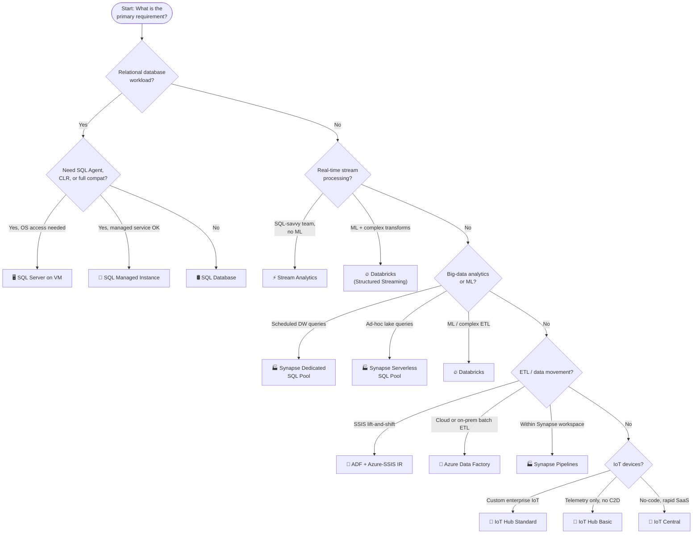

# 🎯 Exam Caveats & Quick-Reference Cheatsheet
{: .no_toc }

**Last-minute review — exam traps, decision trees, and must-memorise numbers**
{: .fs-5 .fw-300 }

---

## Table of Contents
{: .no_toc .text-delta }

1. TOC
{:toc}

---

## ⚠️ The Most Dangerous Exam Traps

### Trap 1 — SQL Managed Instance takes ~6 hours to provision
> ❌ "Deploy SQL Managed Instance quickly for a demo"
> ✅ SQL MI provisions in **~6 hours** — use SQL Database for fast provisioning

Managed Instance deploys into a customer VNet and undergoes full cluster provisioning. If the scenario requires rapid deployment, the answer is **SQL Database**.

---

### Trap 2 — SQL Database Basic tier does NOT have FIFO SQL Agent
> ❌ "Migrate on-prem SQL Server with SQL Agent jobs to SQL Database"
> ✅ SQL Database does NOT support SQL Server Agent — use **SQL Managed Instance**

SQL Agent, CLR, cross-database queries, and linked servers are only available in SQL Managed Instance or SQL Server on VM.

---

### Trap 3 — Auto-Failover Groups vs Active Geo-Replication
> ❌ "Use Active Geo-Replication for transparent failover — no app changes"
> ✅ Active Geo-Replication requires the **app to detect failover and reconnect**. For transparent failover with a single connection string, use **Auto-Failover Groups**

Auto-Failover Groups provide a listener endpoint that survives regional failover automatically.

---

### Trap 4 — SQL Server on VM single instance SLA is only 99.9%
> ❌ "Deploy a single SQL Server VM for a 99.99% SLA requirement"
> ✅ A single VM only achieves **99.9%** SLA. Reach 99.99% with **Always On AG across Availability Zones**

The exam tests whether you know a single VM is insufficient for high availability targets.

---

### Trap 5 — ADF Self-hosted IR vs Azure IR
> ❌ "Use Azure IR to connect to an on-premises SQL Server"
> ✅ On-premises or private-network sources require a **Self-hosted Integration Runtime**

Azure IR only handles cloud-to-cloud. Self-hosted IR is installed on a machine with network access to the on-premises source.

---

### Trap 6 — Azure-SSIS IR is billed even when idle
> ❌ "Leave Azure-SSIS IR running to reduce latency when packages run"
> ✅ Azure-SSIS IR **bills per vCore-hour while running** — start it before package execution, stop it after

Leaving it always-on significantly inflates cost. Use ADF triggers to start/stop the IR around SSIS execution windows.

---

### Trap 7 — ADF Tumbling Window vs Schedule Trigger
> ❌ "Use a schedule trigger for incremental loads with backfill and dependency"
> ✅ Only **Tumbling Window triggers** support dependency chaining, retry, and backfill guarantees

Schedule triggers fire at a point in time regardless of previous runs. Tumbling Window guarantees sequential, exactly-once processing of each time window.

---

### Trap 8 — Stream Analytics Windowing types
> The most common exam trap in this domain. Know the four types cold:
> - **Tumbling** → fixed, no overlap (e.g., "every 5 minutes")
> - **Hopping** → fixed window, advancing hop (e.g., "10-minute average every 1 minute")
> - **Sliding** → event-triggered, overlap (e.g., "within any 5-minute span")
> - **Session** → gap-based, variable size (e.g., "device active period")

---

### Trap 9 — Stream Analytics Reference Data is NOT live
> ❌ "Use Stream Analytics reference data for real-time device metadata lookups"
> ✅ Reference data is loaded from **Blob storage at job start** and refreshed on a schedule — it is **not live**

For truly live lookup data, push the lookup into a stream input instead, or use an Azure Function output to call an external API.

---

### Trap 10 — Synapse Dedicated Pool bills even when paused (storage)
> ❌ "Pausing the Dedicated SQL Pool stops all costs"
> ✅ Pausing stops **compute billing**, but **storage continues to bill**

Storage is always billed. Cost optimisation means pausing compute during off-hours, not eliminating all charges.

---

### Trap 11 — Synapse Serverless SQL Pool is read-only
> ❌ "Use Synapse Serverless SQL Pool to ingest and store data"
> ✅ Serverless SQL Pool **cannot write data** — it queries external files in ADLS Gen2

For writing data to the data lake, use ADF Copy Activity, Spark Pool, or Synapse Pipelines.

---

### Trap 12 — Databricks All-Purpose vs Job Clusters
> ❌ "Use an all-purpose cluster for nightly batch ETL to save on setup time"
> ✅ All-purpose clusters are **more expensive per DBU** and stay running between jobs. Use **Job clusters** for production scheduled workloads

Job clusters are ephemeral — they start, run the job, then terminate. They use the **Jobs compute** DBU rate which is significantly cheaper.

---

### Trap 13 — Databricks Unity Catalog requires Premium
> ❌ "Set up Unity Catalog for data governance on a Standard-tier workspace"
> ✅ Unity Catalog, Delta Live Tables, and column-level security all require **Databricks Premium**

Standard tier has workspace-level RBAC only. Premium adds cross-workspace governance via Unity Catalog.

---

### Trap 14 — IoT Hub Basic tier has no Cloud-to-Device
> ❌ "Use IoT Hub Basic to send firmware update commands to devices"
> ✅ Basic tier supports **Device-to-Cloud only**. Cloud-to-Device messages, Device Twin, and Direct Methods all require **Standard tier**

If the scenario involves any form of back-end-to-device communication or state management, the answer is Standard.

---

### Trap 15 — IoT Hub Message Routing vs Event Grid
> ❌ "Use IoT Hub message routing to react to device connect/disconnect events"
> ✅ Message routing handles **telemetry data**. Device lifecycle events (connect, disconnect, twin changes) are published to **Azure Event Grid**

IoT Hub publishes device lifecycle events to Event Grid — subscribe to Event Grid for reactive automation on device state changes.

---

### Trap 16 — DPS for zero-touch provisioning, not IoT Hub alone
> ❌ "Manually register each device in IoT Hub at the factory"
> ✅ For large-scale automated provisioning, use **Device Provisioning Service (DPS)**

DPS allows devices to self-register at first boot using certificates or TPM attestation, with no manual device registry entries.

---

## 📋 Must-Memorise Numbers

### Azure SQL Limits

| Property | Value |
|----------|-------|
| SQL Database max DB size (Hyperscale) | **100 TB** |
| SQL Database max DB size (General Purpose / Business Critical) | **4 TB** |
| SQL Managed Instance provisioning time | **~6 hours** |
| PITR max retention | **35 days** |
| LTR max retention | **10 years** |
| Elastic Pool max databases (Standard) | **500** |
| Active Geo-Replication max secondaries | **< 5s** |
| Auto-Failover Group RTO (automatic) | **< 30s** |

### Synapse Analytics Limits

| Property | Value |
|----------|-------|
| Dedicated SQL Pool max DWUs | **DW30000c** |
| Serverless SQL Pool max query duration | **24 hours** |
| Synapse SLA | **99.9%** |

### Stream Analytics Limits

| Property | Value |
|----------|-------|
| Max Streaming Units (default) | **192 SUs** |
| Approx throughput per SU | **~1 MB/s** |
| Compatibility level (recommended) | **1.2** |

### IoT Hub Limits

| Property | Value |
|----------|-------|
| Free tier max messages/day | **8,000** |
| Free tier max devices | **500** |
| S1/B1 max messages/day | **400,000** |
| S3/B3 max messages/day | **300,000,000** |
| Max message size | **256 KB** |

---

## ⚡ Decision Tree — Choosing the Right Service

---

## 🃏 Flash Card — One-Line Definitions

| Service | One-Line Definition |
|---------|-------------------|
| **SQL Database** | Fully managed PaaS relational DB; serverless option, Hyperscale up to 100 TB |
| **SQL Managed Instance** | PaaS SQL Server with ~99% compat, VNet-injected; takes ~6h to provision |
| **SQL Server on VM** | IaaS full SQL Server; 100% compat, OS access, you manage patching |
| **Azure Data Factory** | Serverless ETL/ELT orchestration; Self-hosted IR for on-prem, SSIS IR for lift-and-shift |
| **Stream Analytics** | Serverless real-time SQL on streams; best-in-class windowing, Power BI output |
| **Synapse Analytics** | Unified DW + Spark + pipelines; Dedicated = MPP warehouse, Serverless = pay-per-scan |
| **Databricks** | Spark-first analytics + ML platform; Delta Lake, Unity Catalog, MLflow, DLT |
| **IoT Hub** | PaaS device broker; Standard = bidirectional, Basic = D2C only |

---

## 🔑 Feature Lock-In Summary

| If the exam says… | The answer is… |
|------------------|---------------|
| SQL Agent jobs in a managed service | **SQL Managed Instance** |
| DB size > 4 TB, fully managed | **SQL Database Hyperscale** |
| Transparent failover, no app change | **Auto-Failover Groups** |
| Backup retention beyond 35 days | **Long-Term Retention (LTR)** |
| SSIS packages, no rewrite | **ADF + Azure-SSIS IR** |
| On-premises data source in ADF | **Self-hosted IR** |
| Incremental load with backfill guarantee | **ADF Tumbling Window trigger** |
| Real-time SQL aggregation every 5 min, no overlap | **Stream Analytics Tumbling Window** |
| Rolling 10-min average, recalculated every 1 min | **Stream Analytics Hopping Window** |
| Alert if 3 errors in any 5-min span | **Stream Analytics Sliding Window** |
| Ad-hoc queries on Parquet in ADLS, no provisioning | **Synapse Serverless SQL Pool** |
| Analytics on Cosmos DB without consuming RUs | **Synapse Link for Cosmos DB** |
| Nightly DW queries, pause overnight to save | **Synapse Dedicated SQL Pool** |
| ACID transactions on data lake | **Delta Lake (Databricks)** |
| Column-level security across Databricks workspaces | **Unity Catalog (Databricks Premium)** |
| SCD Type 2 in lakehouse | **Delta Lake MERGE INTO** |
| IoT device behind port-443-only firewall | **MQTT over WebSockets** |
| Send commands back to IoT devices | **IoT Hub Standard** |
| React to device connect/disconnect | **IoT Hub + Event Grid** |
| Zero-touch factory device provisioning | **Device Provisioning Service (DPS)** |
| No-code IoT platform, business user manages | **Azure IoT Central** |
| Local ML inference on device | **Azure IoT Edge** |
| Real-time Power BI dashboard from IoT stream | **Stream Analytics → Power BI output** |
| Highest SLA with no special config | **Azure SQL Database / ADF (99.99%)** |

---

## ✅ Final Exam Checklist

Before sitting the exam, verify you can answer these without hesitation:

- [ ] What are the three SQL deployment options and their key differentiators?
- [ ] What features does SQL Managed Instance have that SQL Database does not?
- [ ] What is the difference between Auto-Failover Groups and Active Geo-Replication?
- [ ] What is the max PITR retention? What is LTR and when is it used?
- [ ] What Integration Runtime type connects to on-premises sources in ADF?
- [ ] How is Azure-SSIS IR billed, and what is the cost-saving pattern?
- [ ] What is the difference between a Tumbling and a Hopping window?
- [ ] What is the difference between a Sliding and a Session window?
- [ ] What does Synapse Serverless SQL Pool NOT support (hint: it is read-only)?
- [ ] What is the cost difference between Synapse Dedicated and Serverless?
- [ ] What Databricks cluster type should be used for production batch jobs?
- [ ] What Databricks tier is required for Unity Catalog?
- [ ] What IoT Hub tier is required for Cloud-to-Device messages?
- [ ] What is Device Provisioning Service used for?
- [ ] How do you react to device lifecycle events in IoT Hub?

---

[← 07 — Feature Comparison](/az-305-data-analytics/07-feature-comparison/) | [Back to Home →](/az-305-data-analytics/) 